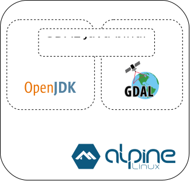

# dockerized gdal
Dockerización de GDAL con dependencias JAVA incluidas, basado en Alpine (también en otras opciones de SO).

El propósito es que la misma pueda ser utilizada como base para instalar Geoserver con la [extension de GDAL](https://docs.geoserver.org/stable/en/user/data/raster/gdal.html) incluida.

Criterios:

- Alpine 3.11 -> imagen basada en Alpine como distribución "liviana".
- OpenJDK -> por preferencia de uso libre, licencia, etc. En la [version 15](https://openjdk.java.net/projects/jdk/15/).
- GDAL -> release 2.1.4 con el fin de mantener compatibilidad con Geoserver 2.16.x o superior.

En sucesivas actualizaciones se publicaran imagenes en DockerHub, con versiones renovadas de Alpine (u otras distribuciones), OpenJDK y GDAL.

## Detalles

Se adjunta diagrama MxGraph (**diagrama.mxgraph.xml**) para uso en documentación (como también el SVG del mismo, por uso en este documento).

Se provee script para build de la imagen (**build.sh**) con el fín de simplificar el proceso.

## Diagrama

Ejemplo de diagrama para la versión Alpine:

